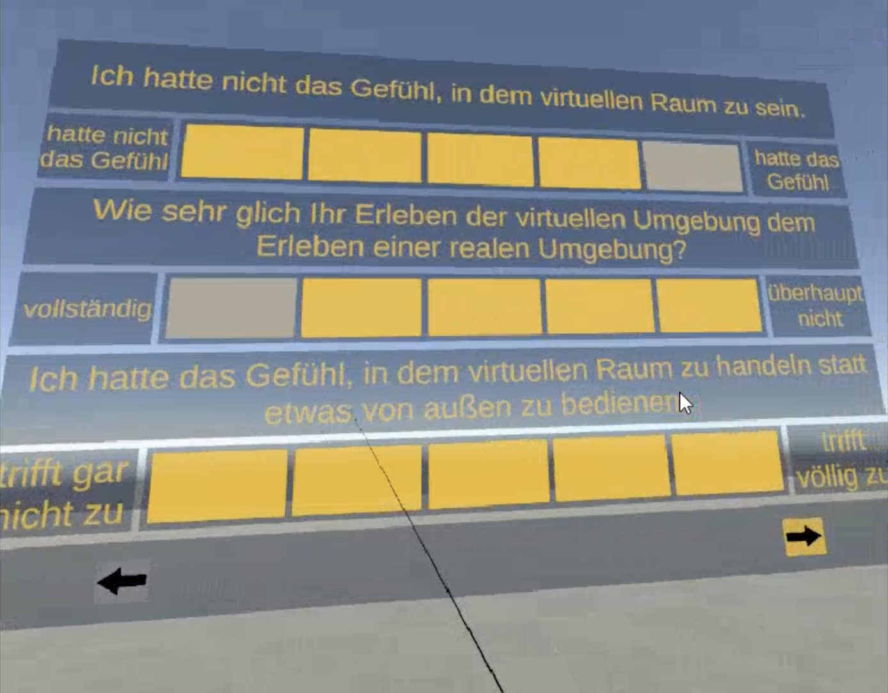
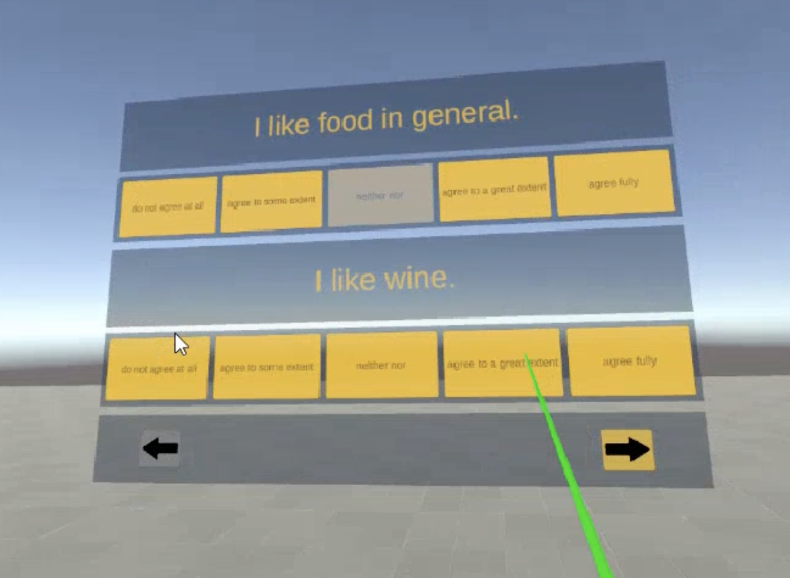
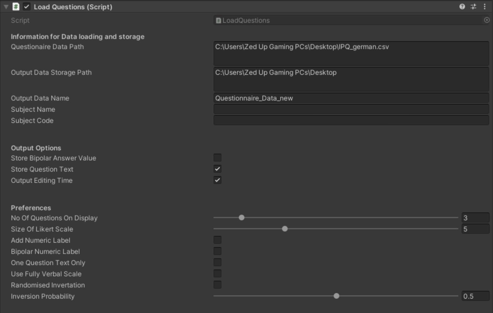

# Immersive Questionnaire Tool for Unity VR (IQT)

**IQT** is a Unity-based tool designed to conduct Likert-scale questionnaires directly within virtual reality environments. This asset simplifies the process of collecting user feedback—such as on user experience or presence—by offering a flexible, immersive, and easy-to-use in-VR interface for questionnaire delivery and data collection.

> This project was developed as part of my Bachelor's thesis in Computer Science.

## Features

- **Built-in Questionnaires**  
  Comes pre-installed with two widely used instruments:  
  - **IPQ** – Igroup Presence Questionnaire  
  - **UEQ** – User Experience Questionnaire

- **Custom Questionnaire Support**  
  Easily import your own questionnaires in CSV format.

- **Highly Configurable**  
  Customize the visual presentation, layout, and data export format.

- **Export Results**  
  Collected questionnaire data can be exported for further analysis.

- **Research-Ready**  
  Designed for researchers and developers conducting user studies in VR.


## Getting Started


1.	Clone or download this repository.
2.	Add the folder to your Unity project.
3.	Place the Questionnaire object into your VR scene.
4.	Use the sliders and properties in the Unity Inspector to customize the component to your needs
(e.g., number of questions displayed simultaneously, scale size, layout).
5.	Import your own questionnaire in CSV format or use the included IPQ/UEQ.
6.	Enter Play Mode in VR and start collecting responses.
7.	Export the results for further analysis.

## UI Preview
The examples shown above illustrate two possible configurations of the questionnaire as it appears in VR. The user interface is highly configurable via the Unity Inspector, allowing precise control over elements such as the number of visible questions, scale layout, and labeling. This flexibility enables seamless adaptation to a wide range of experimental designs and user experience requirements.

<table>
  <tr>
    <td align="center">
      <br>
      <a href="demo_vids/demo_2.mp4">📥 Download Demo Video 1</a>
    </td>
    <td align="center">
      <br>
      <a href="demo_vids/demo_1.mp4">📥 Download Demo Video 2</a>
    </td>
  </tr>
</table>

## Questionnaire Format

To use a custom questionnaire, provide a `.csv` file using semicolons (`;`) as separators, with the following structure:

```csv
Introduction text;
Closing text;
Question;LabelLeft;LabelRight;
...
```

## Overview of the Component Configuration in the Unity Inspector

### Data Loading & Storage
- **Questionnaire Data Path**: Path to your `.csv` file containing the questionnaire.
- **Output Data Storage Path**: Directory where responses should be saved.
- **Output Data Name**: Filename for the response data.
- **Subject Name**: Identifier for the participant.
- **Subject Code**: Custom participant code.

### Output Options
- **Store Bipolar Answer Value**: Save answers as bipolar numeric values.
- **Store Question Text**: Include original question text in the output.
- **Output Editing Time**: Log how long participants take to edit each question.

### Preferences
- **No Of Questions On Display**: Number of questions shown simultaneously.
- **Size Of Likert Scale**: Size of the rating scale (e.g., 5-point, 7-point).
- **Add Numeric Label**: Add numeric labels to the Likert scale.
- **Bipolar Numeric Label**: Use bipolar labels (e.g., -3 to +3).
- **One Question Text Only**: Display only one instance of the question text.
- **Use Fully Verbal Scale**: Use full-text labels for scale points.
- **Randomised Invertation**: Randomly invert question polarity.
- **Inversion Probability**: Set the probability (0–1) of inverting a question.

<div align="">
  
</div>
